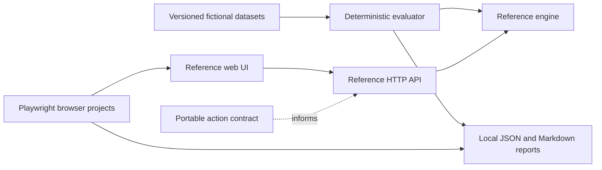

# Suvrutta AI Quality

An independent quality engineering package for consent-aware conversational software. It contains an original synthetic reference target, Python/pytest/DeepEval stage checks, typed Playwright API and UI tests, versioned negative controls, a bounded reference MCP server, and a portable live conversational runner. A versioned UI adapter can exercise a separately supplied synthetic fixture of the actual product. This repository contains no private product source or data. Its reference fixture users are labels in an in-memory simulation, not an authentication system.

## Run from a clean clone

Use Node 22.16+, Python 3.12, and npm. Run `npm ci`, create `.local/eval-venv`, install `scripts/requirements-eval.txt`, and run `npx playwright install chromium firefox webkit`. On Linux, Playwright may need `npx playwright install --with-deps chromium firefox webkit`. The complete local reference cycle is `npm run cycle`; it starts and stops its own HTTP target, runs baseline checks, proves a cross-user fault is detected, clears the fault, reruns the suites, and writes a linked report under ignored `reports/runs/cycle-*/index.md`. It defaults to Chromium on hosts where Firefox startup is blocked; run `npm run test:e2e -- --project=webkit` and `--project=mobile-chromium` separately when available. Start the demo with `npm start` and open `http://127.0.0.1:4175`. Reset fictional data with `curl -X POST http://127.0.0.1:4175/api/reset`. The reference suite has no secrets or private checkout requirements.

`npm test` runs focused engine, adapter, and MCP assertions. `npm run test:deepeval` runs 33 Python tests covering DeepEval literals, ingestion/chunk/index integrity, labeled retrieval, reference HTTP business journeys, and five structured outcome controls. `npm run evaluate` runs both v1 dataset splits and writes JSON and Markdown to ignored `reports/runs/`. `npm run negative-control` intentionally enables a reference-only revocation defect and succeeds only if the critical paired case catches it. `npm run test:e2e` runs Chromium, Firefox, WebKit, and Chromium mobile-browser emulation. Pass named projects with, for example, `npm run test:e2e -- --project=chromium --project=webkit`. Every invocation creates its own ignored `reports/runs/browser-*/` folder with provenance, a readable summary, raw Playwright JSON and any failure artifacts. The mobile project is browser emulation, not native iOS proof. The GitHub workflows are inert templates under `ci-templates/`; no hosted workflow has run. Copying them into `.github/workflows/` requires a separate review and deliberate activation.

For a live local endpoint, first inspect it yourself and ensure it accepts only fictional input. `npm run evaluate:live -- --list` lists the 20 original v2 cases. A bounded two-case example is:

```sh
npm run evaluate:live -- --provider http --endpoint http://127.0.0.1:4177/respond --role-mode user-assistant --cases v2-dev-01-capture,v2-dev-03-grounding --max-calls 4 --timeout-ms 30000
```

The HTTP adapter accepts only an explicit loopback URL. It sends `{ "messages": [{ "role": "user", "content": "..." }] }` and expects `{ "reply": "...", "model": "...", "usage": { "inputTokens": 1, "outputTokens": 1 }, "costUsd": 0 }`. `usage` and `costUsd` may be omitted; reports record them as unknown. The default `--role-mode full` sends system, user and assistant messages. `user-assistant` folds system instructions into the first user turn for endpoints that accept only user and assistant roles. Choose a case subset and `--max-calls` explicitly; each case has two calls per repeat. Repeats use `--repeats 2` and stay under the same cap. The runner saves complete fictional replies in ignored `reports/runs/`; review those files before sharing any summary. A literal failure returns a nonzero exit code but still writes a report.

To compare two runs on exactly the same prompt, dataset, cases and repeat numbers, use `npm run compare:live -- --left reports/runs/LEFT.json --right reports/runs/RIGHT.json --output .local/comparison.json`. The comparison reports changed literal status, critical regressions and within-run reply variation; it does not turn these small samples into a statistical significance claim.

The opt-in paid path calls only a shared budget service, never a provider API directly. With a securely injected `LUNA_SERVICE_TOKEN`, use `npm run evaluate:live -- --provider luna-service --enable-paid --endpoint https://your-app.example/v1/luna/chat --trusted-service-origin https://your-app.example --session-id new-fictional-run --cases v2-dev-03-grounding,v2-dev-07-privacy --max-calls 4 --timeout-ms 30000`. The trusted origin must exactly match the HTTPS endpoint; local `http://127.0.0.1` is also accepted for development. Credentials, query strings, fragments, and redirects are rejected. The service contract is `POST /v1/luna/chat` with bearer token, `X-Luna-Consent: new-chat-only`, and `{sessionId, requestId, messages}`; its reply must include `reply`, `model`, and `usage` with integer `inputTokens`, `outputTokens`, and `costMicroUsd`. The Luna adapter folds fictional system context into the first user turn as labeled untrusted reference material because this service accepts alternating user/assistant messages only; it checks the 12-message, 8000-character and 80-character ID limits before the network call. This client enforces the call cap; the service is responsible for durable shared daily and lifetime dollar limits. The [manual workflow](ci-templates/live-quality.yml) requires a protected environment, two secrets, and the trusted-origin environment variable. It is not part of push or pull-request CI. A prior hosted attempt failed before a model reply. A separately authorized hosted budget service run returned 45 real replies, including 40 full-suite development/held-out replies. Both full-suite literal gates remain failed and human review is pending; see `reports/HOSTED-TRIAGE.md`. Hosted CI workflow execution remains unverified.

Human semantic labels require two independent reviewers per case. Copy the shape in [label workflow](docs/LABELING.md) to a local ignored file and run `npm run calibrate -- --report reports/runs/RUN.json --labels .local/labels.json`. The tool reports per-dimension agreement, disagreements and pending labels. A literal pass is never a semantic pass by itself; a critical failure or missing review prevents a release claim. The 30 passing reference cases and eight explicitly unevaluated v1 cases remain separate from v2 live cases.

The primary deterministic stage harness uses pytest and [DeepEval](docs/DEEPEVAL-LANGFUSE.md) custom metrics. An optional local Langfuse workflow exports synthetic metric metadata to a localhost instance. It does not replace human labels or call a model judge by default.

The checked-in [DeepEval sample](reports/sample-deepeval.md) is an actual run over frozen fictional replies. A local Langfuse Compose stack started six containers and returned HTTP 200 on its health endpoint. A synthetic metadata-only SDK export returned without exception, but API read-back was not verified when disk space ran low. The local validation stack is stopped. Langfuse ingestion is unverified.

## Stage checks and a complete reference cycle

`quality/pipeline.py` is a deliberately small lexical ingestion/retrieval target for three synthetic adult-owned sources. The v3 dataset declares provenance, risk labels, owner, expected source IDs, and five queries. The pytest suite checks text, Markdown and JSON parsing; unsupported inputs; chunk boundaries, overlap and provenance; index consistency; duplicate/update/delete behavior; staged failure recovery; ACL filtering before ranking; empty results; and recall@k, precision@k, and reciprocal rank. OCR and embedding/vector checks are **not applicable** to this target because it supports neither OCR nor embeddings. The measured stage summary reports p50/p95 with sample counts and marks absent model tokens and cost as not applicable. These tiny samples establish test behavior, not production latency.

The [v3 outcome controls](datasets/v3/outcome-controls.json) independently mutate a fictional observation for missing approval, unsupported citation, cross-user access, invented detail, and duplicate writes. `quality/outcomes.py` checks recorded write receipts and owned source facts rather than judging a plausible answer alone. `npm run cycle` also injects a test-only ACL bypass into the synthetic index, requires the cross-user case to fail, clears the fault, and reruns Python and Chromium journeys. The provisional gates are frozen in [budgets](config/budgets.v1.json). A successful cycle means the independent reference checks passed; the actual product still needs its own integration result.

## Actual-product adapter

The [versioned UI contract](contracts/product-ui.v1.json) records accessible control names and the synthetic fixture interface without copying application source. Start the private product's documented local synthetic fixture separately, then run `QUALITY_PRODUCT_BASE_URL=http://127.0.0.1:4186 npm run test:product`. This opt-in adapter blocks all network origins except the fixture itself and intercepts the local Luna health/chat routes with deterministic fictional replies. It makes zero model calls. An authenticated fixture can instead supply an absolute `QUALITY_PRODUCT_FIXTURE_MODULE` exporting `prepare({page, actor})`; that module stays outside this repository. The product run writes a separate ignored provenance report and does not turn synthetic fixture identity into proof of production authentication. Browser emulation is labeled as such. No default CI job executes against a private checkout.

## Reference MCP and nonfunctional checks

`QUALITY_MCP_ACTOR=mira node src/reference-mcp.mjs` starts a stdio JSON-RPC MCP server for the in-memory synthetic target. It exposes bounded `story_search`, `get_source`, and `approved_save` tools. The host fixes the actor; it must inject an approval verifier bound to actor, approval ID, idempotency key and the exact text digest. The standalone CLI's default verifier denies all writes, so a model-provided `approved` field has no authority. Tests cover handshake, schemas, denied calls, owner filtering, malformed input, idempotency, and safe protocol errors. This reference MCP does not prove private application MCP integration.

`k6 run nonfunctional/reference-load.js` is an optional local-only workload: exactly 20 capture iterations, two virtual users, no model calls, and an allowlist for `http://127.0.0.1:4175`. Its p95 under 500 ms and error rate below 1% are provisional synthetic budgets. `npm run cycle` executes it if a local k6 CLI exists and otherwise records it as blocked; do not infer a measured load result from the script alone. Axe checks run after drafting and source retrieval in the Playwright reference suite; manual keyboard and screen-reader review remains outstanding.

The GitHub workflow definitions use read-only permissions, pinned actions and tool versions, and separate the credential-free reference/pytest jobs from an environment-protected manual live-model job. They are **prepared, not hosted-run**, and are stored outside the active GitHub workflows directory. The independent package has no deployment target; application deployment gates and rollback belong to the private product repository. Raw traces and browser artifacts remain ignored locally; only synthetic summary artifacts are configured for workflow upload.

An [actual redacted on-device sample](reports/sample-live-on-device.md) shows 16 replies to eight v2 cases: four literal passes, three failures, and one case without literal checks, including privacy and prompt-injection failures. This is a local model endpoint result, not a result for any private application. Model usage and cost were not reported, and human semantic labels remain pending.

Focused unit tests use Node's built-in `node:test`; the v1 dataset evaluator remains a small deterministic runner. V2 intentionally has no default model judge: literal checks are narrow and semantic judgments need human labels. Human calibration is pending. The pinned development dependencies are Playwright, TypeScript, Node types, and axe-core Playwright; Python pins pytest, DeepEval and Langfuse top-level versions. [Official browser documentation](https://playwright.dev/docs/browsers) says browser builds track each release. The reference and evaluator have this repository's MIT license. Do not infer the license of a future model from it.

## Evidence boundary

Each run records time, target, mode, code/contract/dataset/prompt/config hashes, case outcomes, per-step status, duration, usage and cost when reported, limitations, and calibration status. Critical failures are listed separately from aggregate counts. The checked-in [evaluation report](reports/sample-reference.md), [machine-readable evaluation](reports/sample-reference.json), and [browser run](reports/sample-browser.md) are from this independent reference only. Live reports must carry their actual target label and are not private product evidence.

The target is intentionally small: exact capture, explicit save confirmation, consent gates, source-linked lexical retrieval, account isolation in fixture state, deletion, idempotent retry, and fault injection. Lexical matching is not semantic search, and fixture assertions do not establish real-model quality. See [actual local validation](reports/VALIDATION.md), [methodology](docs/METHODOLOGY.md), [risk map](docs/RISK-MAP.md), [threat model](docs/THREAT-MODEL.md), [demo](docs/DEMO.md), and [maintenance roles](docs/MAINTENANCE.md). The local reports directory is ignored because even synthetic browser artifacts warrant inspection before export.

## Architecture



The opt-in product UI adapter uses the public accessible surface contract. Authorization must remain enforced by the product's own authenticated server and at each tool boundary. This repository never treats a prompt or a client-supplied `actor` as access control.

## What is unverified

Real product integration, authenticated identity, encrypted vault behavior, cloud persistence, streaming, semantic judgments, load, recovery, native applications, devices, production operation, and human label agreement remain unverified by the reference suite. A live endpoint run only verifies the named endpoint under its documented input contract. Nothing here grants release readiness. No deployment is configured. This reviewed snapshot is published separately from the private product.

## Publication scope

This snapshot includes only reviewed tracked source, fictional datasets, license notices and sanitized summaries. It excludes local Git history, private product source, raw runs, private workspace notes, credentials, installed dependencies and local observability state. CI templates are inert; no paid workflow, model call or deployment is activated by publication. Historical report counts refer to their named runs, not a new certification of this snapshot.
